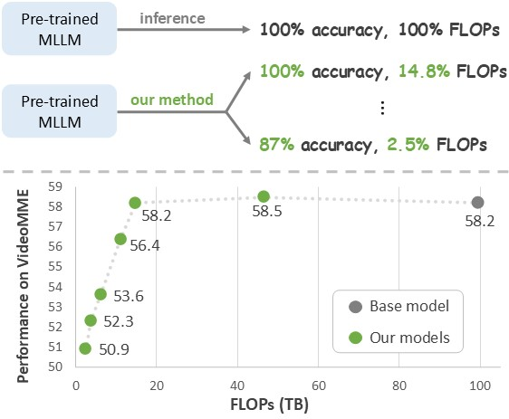
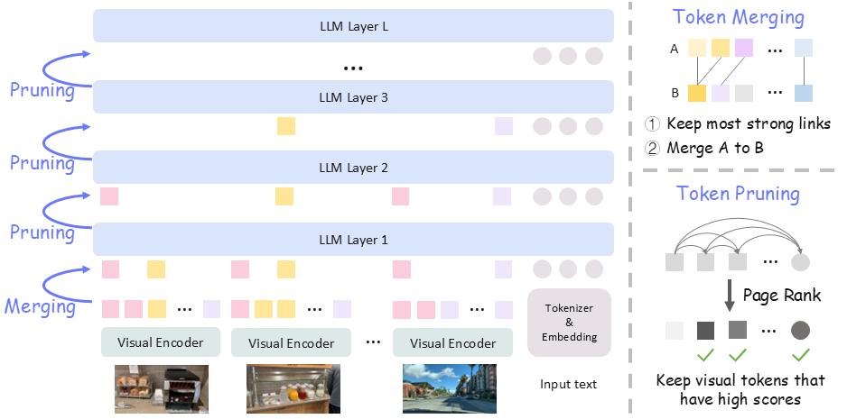

# AIM: Adaptive Inference of Multi-Modal LLMs via Token Merging and Pruning

> **AIM: Adaptive Inference of Multi-Modal LLMs via Token Merging and Pruning** [[Paper](https://arxiv.org/abs/2412.03248)] <br>
> [Yiwu Zhong](https://scholar.google.com/citations?user=irrbH_IAAAAJ&hl=en)<sup>1</sup>, [Zhuoming Liu](https://scholar.google.com/citations?user=HXOVwRAAAAAJ&hl=en)<sup>2</sup>, [Yin Li](https://www.biostat.wisc.edu/~yli/)<sup>2</sup>, [Liwei Wang](https://lwwangcse.github.io/)<sup>#1</sup> <br>
> <sup>1</sup>The Chinese University of Hong Kong, <sup>2</sup>University of Wisconsin-Madison <br>
> (<sup>#</sup> corresponding author) <br>

<p align="center">

</p>


## Overview

Large language models (LLMs) have enabled the creation of multi-modal LLMs that exhibit strong comprehension of visual data such as images and videos. However, these models usually rely on extensive visual tokens from visual encoders, leading to high computational demands, which limits their applicability in resource-constrained environments and for long-context tasks. In this work, we propose a training-free adaptive inference method for multi-modal LLMs that can accommodate a broad range of efficiency requirements with a minimum performance drop. Our method consists of a) iterative token merging based on embedding similarity before LLMs, and b) progressive token pruning within LLM layers based on multi-modal importance. With a minimalist design, our method can be applied to both video and image LLMs. Extensive experiments on diverse video and image benchmarks demonstrate that, our method substantially reduces computation load (e.g., a **7-fold** reduction in FLOPs) while preserving the performance of video and image LLMs. Further, under a similar computational cost, our method outperforms the state-of-the-art methods in long video understanding (e.g., **+4.6** on MLVU). Additionally, our in-depth analysis provides insights into token redundancy and LLM layer behaviors, offering guidance for future research in designing efficient multi-modal LLMs.


<p align="center">

</p>


## Updates
- [03/23] 🔥 We release our code!


## Scripts

### Installation

Please refer to the following scripts for installation. We include some packages to install from source, so that our customized modules can be applied (e.g., token pruning in LLM layers).

```bash
# set up environment and install pytorch
conda create -n aim python=3.10.14
conda activate aim
conda install pytorch==2.3.1 torchvision==0.18.1 torchaudio==2.3.1 pytorch-cuda=12.1 -c pytorch -c nvidia

# clone this repository and install dependencies
git clone https://github.com/LaVi-Lab/AIM
pip install -e ".[train]"

# install our customized packages
# transformers@d750b50 [version '4.45.0.dev0' installed]
cd other_packages/transformers
pip install -e . 
# lmms-eval@a72a9c0 [version '0.2.4' installed]
cd other_packages/lmms-eval
pip install -e . 
# qwen-vl-utils@5c6124c [version '0.0.10' installed]
cd other_packages/qwen-vl-utils
pip install -e . 
```

### Benchmark Evaluation (Accuracy)

To evaluate our method AIM with the base model as LLaVA-OneVision-7B, simply run:

```bash
bash video_bench_eval.sh
```

In `video_bench_eval.sh`, you can remove `attn_implementation=eager` for disabling token pruning, specify `max_frames_num=192` to sample 192 frames per video, and edit `--tasks mlvu` to evaluate on MLVU benchmark. For more details, please refer to the comments in the script.

### Efficiency Measurement (FLOPs and Prefill Time)

We also provide the scripts for calculating the FLOPs and Prefill Time of our method AIM：

```bash
cd other_packages/LLM-Viewer
bash run.sh
```

The key file is `analyze_flex_prefill_only.py`, where you can specify the number of initial visual tokens, the number of text tokens, and the scheduler for pruning tokens across LLM layers.

### Notes
- Core implementations: Our method consists of similarity-based token merging and importance-based token pruning. Token merging is applied before feeding them into LLMs ([llava_arch.py](https://github.com/LaVi-Lab/AIM/blob/main/llava/model/llava_arch.py)), while token pruning is applied within LLM layers ([modeling_qwen2.py](https://github.com/LaVi-Lab/AIM/blob/main/other_packages/transformers/src/transformers/models/qwen2/modeling_qwen2.py)). Their implementations are modular and easy to be adapted for different multi-modal LLMs with various architectures. For example, simply copy-paste the code segments should generally work.


## Citation

If you find this repo useful, please consider citing our paper:
```bibtex
@article{zhong2024aim,
  title={AIM: Adaptive Inference of Multi-Modal LLMs via Token Merging and Pruning},
  author={Zhong, Yiwu and Liu, Zhuoming and Li, Yin and Wang, Liwei},
  journal={arXiv preprint arXiv:2412.03248},
  year={2024}
}
```

## Acknowledgement

- [LLaVA-Next](https://github.com/LLaVA-VL/LLaVA-NeXT): the pre-trained base Video LLM model.

- [LLaVA](https://github.com/haotian-liu/LLaVA): the pre-trained base Image LLM model.

- [LLM-Viewer](https://github.com/hahnyuan/LLM-Viewer): the code for calculating FLOPs and prefill time.

